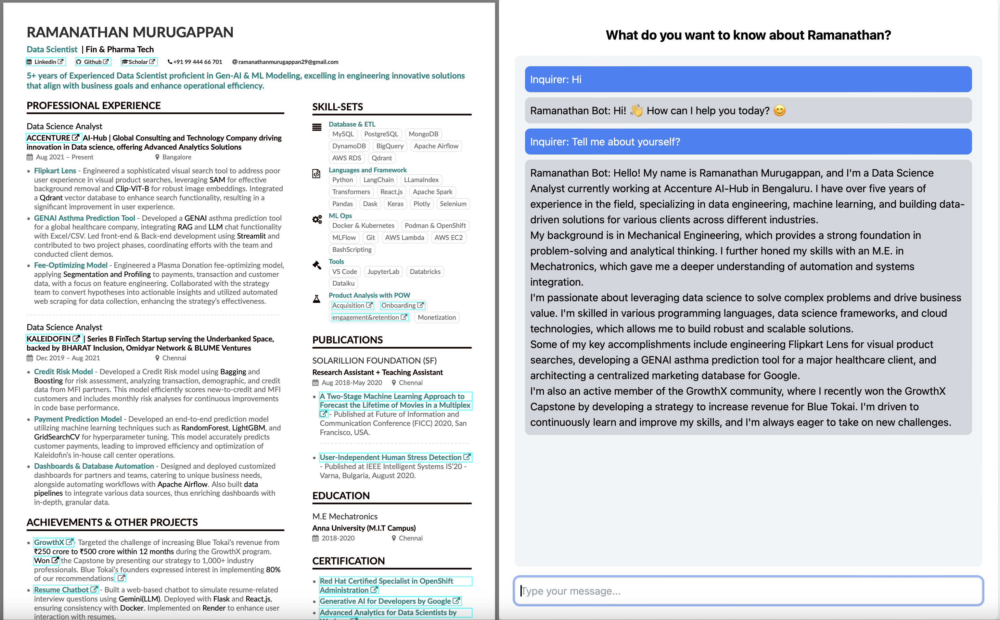

# Resume Chatbot

## Overview

Resume Chatbot is a Flask-based web application that interacts with users to help generate and manage resumes. The application leverages Google's Generative AI API to provide dynamic content suggestions and enhancements for resume building.

This project is containerized using Docker for easy deployment and scalability.

## Features

- **Interactive Resume Building**: Chatbot interface to guide users through resume creation.
- **Generative AI Integration**: Utilizes Google's Generative AI for content generation and recommendations.
- **Dockerized Deployment**: Easily deployable using Docker, suitable for cloud environments like Render.com.

## How the App Looks

Below is a screenshot of the Resume Chatbot in action. The interface is designed to be user-friendly and intuitive, guiding the user step-by-step through the resume creation process. 



- **User Interface**: The chatbot interface is simple and clean, making it easy for users to input their information.
- **Real-time Suggestions**: The app provides real-time suggestions and enhancements to improve the content of your resume.
- **Responsive Design**: The application is designed to work on both desktop and mobile devices.

## Technologies Used

- **Flask**: Python web framework used for building the web application.
- **Google Generative AI**: API used for AI-driven content generation.
- **Docker**: Containerization tool for easy deployment.
- **Render.com**: Hosting platform used for deploying the application.

## Prerequisites

- **Python 3.9+**
- **Docker**

## Setup Instructions

### 1. Clone the Repository

```bash
git clone https://github.com/your-username/resume-chatbot.git
cd resume-chatbot
```

### 2. Build and Run with Docker

To build and run the Docker container:

```bash
docker build -t resume-bot .
docker run -d -p 5001:5001 -e API_KEY="your-google-generative-ai-api-key" resume-bot
```

This will start the Flask app and make it accessible at `http://localhost:5001`.

### 3. Deploy to Render.com

If you wish to deploy the application to Render.com:

- Create an account and set up your project on Render.com.
- Add your environment variables in the Render.com dashboard.
- Connect your GitHub repository to Render.com and deploy.

### 4. Access the Application

Once the Docker container is running, you can access the application at `http://localhost:5001`. If deployed on Render.com, use the provided URL from the Render.com dashboard.

## Project Structure

```
resume-chatbot/
│
├── app.py                 # Main Flask application
├── Dockerfile             # Dockerfile for building the Docker image
├── requirements.txt       # Python dependencies
├── render.yaml            # Configuration for deploying on Render.com
├── templates/
│   └── index.html         # HTML templates for Flask
├── images/
│   └── app-screenshot.png # Screenshot of the app
└── README.md              # This readme file
```

## Contributing

Contributions are welcome! Please feel free to submit a Pull Request.
